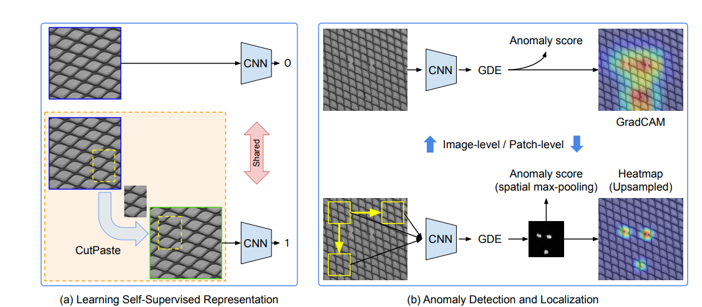

# CutPaste

CutPaste: image from paper

Unofficial implementation of Google's ["CutPaste: Self-Supervised Learning for Anomaly Detection and Localization"](https://arxiv.org/abs/2104.04015) in PyTorch

### Installation
To rerun experiments or try on your own dataset, first clone the repository and install `requirements.txt`.
```
$ git clone https://github.com/LilitYolyan/CutPaste.git
$ cd CutPaste
$ pip install -r requirements.txt
```

### Self-supervised training
Run `train.py` to train self-supervised model on MVTec dataset

For 3 way classification head 
```
$ python train.py --dataset_path path/to/your/dataset/ --num_class 3
```

For binary classification head 
```
$ python train.py --dataset_path path/to/your/dataset/ --num_class 2
```

To track training process with TensorBoard
```
tensorboard --logdir logdirs
```


### Anomaly Detection
To run anomaly detection for MVTec with Gaussian Density Estimator 
```
$ python anomaly_detection.py --checkpoint path/to/your/weights --data path/to/mvtec

```
### TODO
- [X] Self-supervised model 
- [X] Gaussian Density Estimator
- [ ] EfficientNet Implementation
- [ ] Localization

Any contribution is appreciated!

# Experiment Results
To train self-supervised model we used same hyperparameters as was used in paper: 
| Hyperparameter  | Value |
| ------------- | ------------- |
| Number of epochs | 265 |
| Batch size | 32 |
| Learning rate | 0.03 |
| Input size | 256 |


## AUC comparison of our code and paper results

| Defect Name  | CutPaste binary (ours) | CutPaste binary (paper's)  | 
| ------------- | ------------- | ------------- | 
| tile  | 84.1 | 95.9 | 
| wood  | 89.5 | 94.9 | 
| pill | 88.7 | 93.4 | 
| leather | 98.7 | 99.7 | 
| hazelnut | 98.8 | 91.3 | 
| screw | 89.2 | 54.4 | 
| cable | 83.3 | 87.7 | 
| toothbrush | 94.7 | 99.2 | 
| capsule | 80.2 | 87.9 | 
| carpet | 57.9 | 67.9 | 
| zipper | 99.5 | 99.4 | 
| metal_nut | 91.5 | 96.8 | 
| bottle | 98.5 | 99.2 | 
| grid | 99.9 | 99.9 | 
| transistor | 84.4 | 96.4 | 


## ROC curves using embeddings from binary classification for self-supervised learning
<p float="left">
  
   
  
</p>
<p float="left">
  
   
  
</p>
<p float="left">
  
   
  
</p> 

<p float="left">
  
  
   
</p> 

<p float="left">
  
   
  
</p>


## Self-supervised binary training results

<p float="left">
  
   
</p>
<p> 
    <em>Training accuracy and loss for bottle</em>
</p>
 

